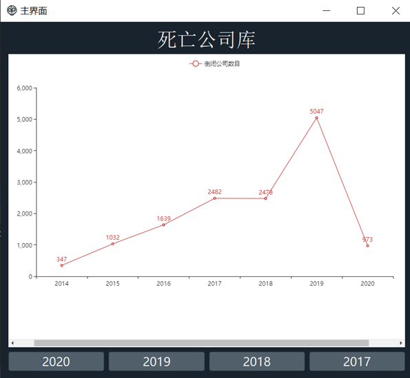
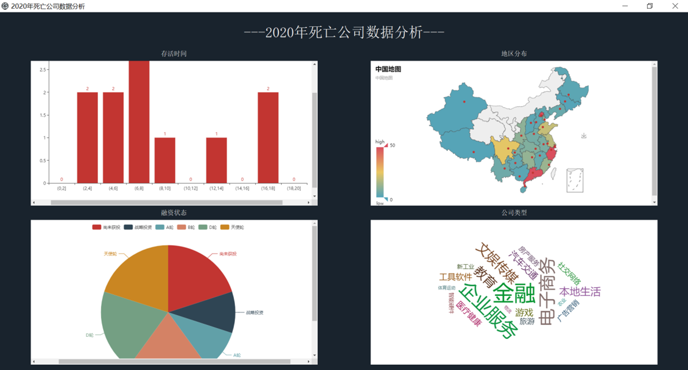

## 死亡公司数据爬取与分析

> 📝2020秋Python大作业
> 

### 01. dir & doc
- dir
  - `dates`：存放爬取数据
  - `html`：存数据分析图
  - `images`：存放UI界面图标
- doc
  - `deadNum_year.py`：爬取2014-2020年每年死亡公司数目
  - `getdates.py`：爬取数据
  - `getdate2018.py`：爬取2018年数据
  - `cityMap.py`：生成死亡公司城市分布地图
  - `companyType`：生成死亡公司类型词云图
  - `liveTimeAnalyze.py`：生成死亡时间分布柱状图
  - `statusAnalyze.py`：生成死亡公司融资状态分布饼图的
  - `UI.py`：数据分析展示主界面代码
  - `ui20--.py`：20--数据分析展示界面
  - `findCompany.py`：查询产业对应的公司

### 02. env
`python 3.8`
`pyecharts` `csv` `selenium` `time` `re` `pandas` `PyQt5` `qdarkstyle` `sys` `functools` `collections`

### 03. ui
- #### 主界面

- #### 二级界面

